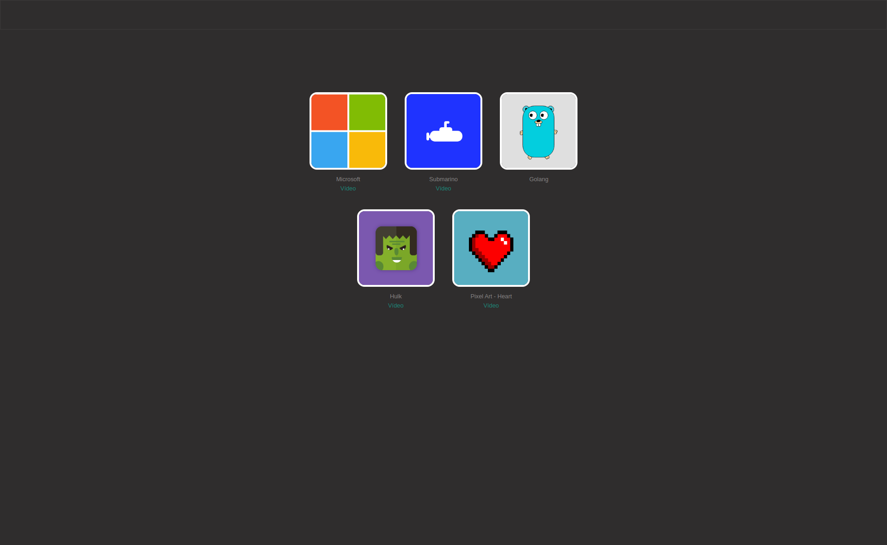

# Awesome drawings made with Pure CSS

  

- [x] Incrível Hulk | [Vídeo no youtube](https://youtu.be/L3LXwqVMuAE)
- [x] Logo Golang
- [x] Logo Microsoft | [Vídeo no youtube](https://youtu.be/bmjUBZo4fv0)
- [x] Logo Submarino | [Vídeo no youtube](https://youtu.be/45GOzxF2v8A)
- [x] Pixel Art - Heart | [Vídeo no youtube](https://youtu.be/FR1l-1LKjqE)

## 👩 Author

| [ <b>@laisfrigerio</b>](https://github.com/laisfrigerio)  |
| :---: |

## 📄 License

This project is licensed under the MIT License - see the LICENSE.md file for details